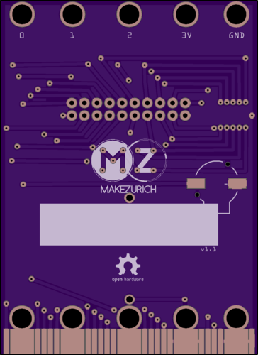
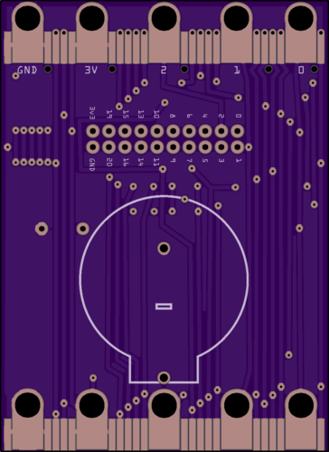
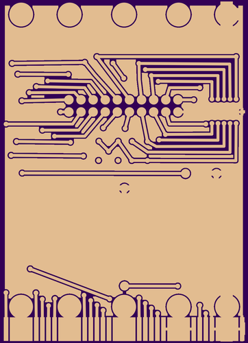
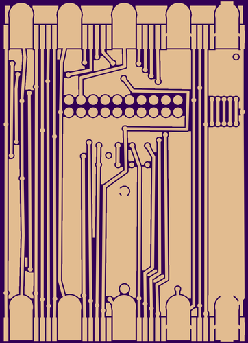
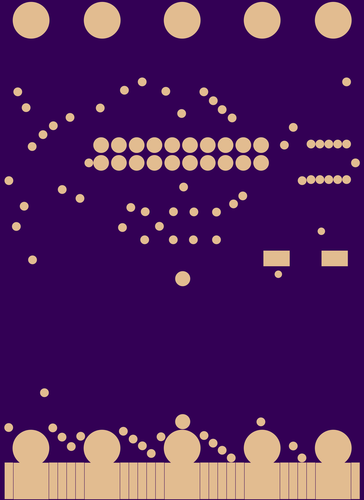
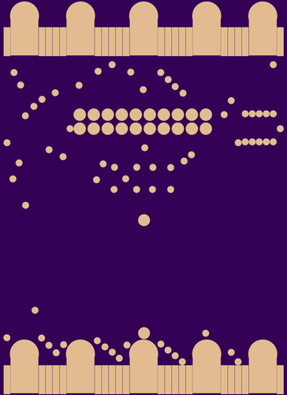

# micro:bit badge

This is a super secret, open source project to design a PCB badge for [Make Zurich 2017](https://makezurich.ch).

## Board renders

The renders are courtesy of [OSH Park](https://oshpark.com).

### Board top & bottom
 

### Top & bottom copper layers
 

### Top & bottom solder marks
 

## Credits
Thanks to [Urs Marti](https://github.com/urs8000/) and [Owen Brotherhood](https://github.com/OwenBrotherwood) for all the support during the development of this board.
